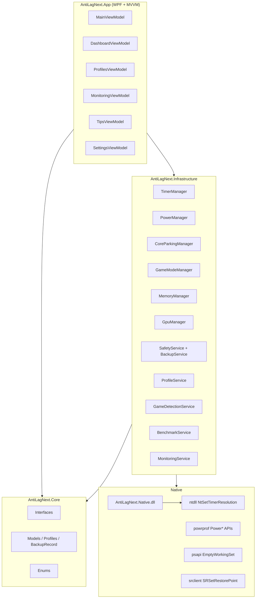
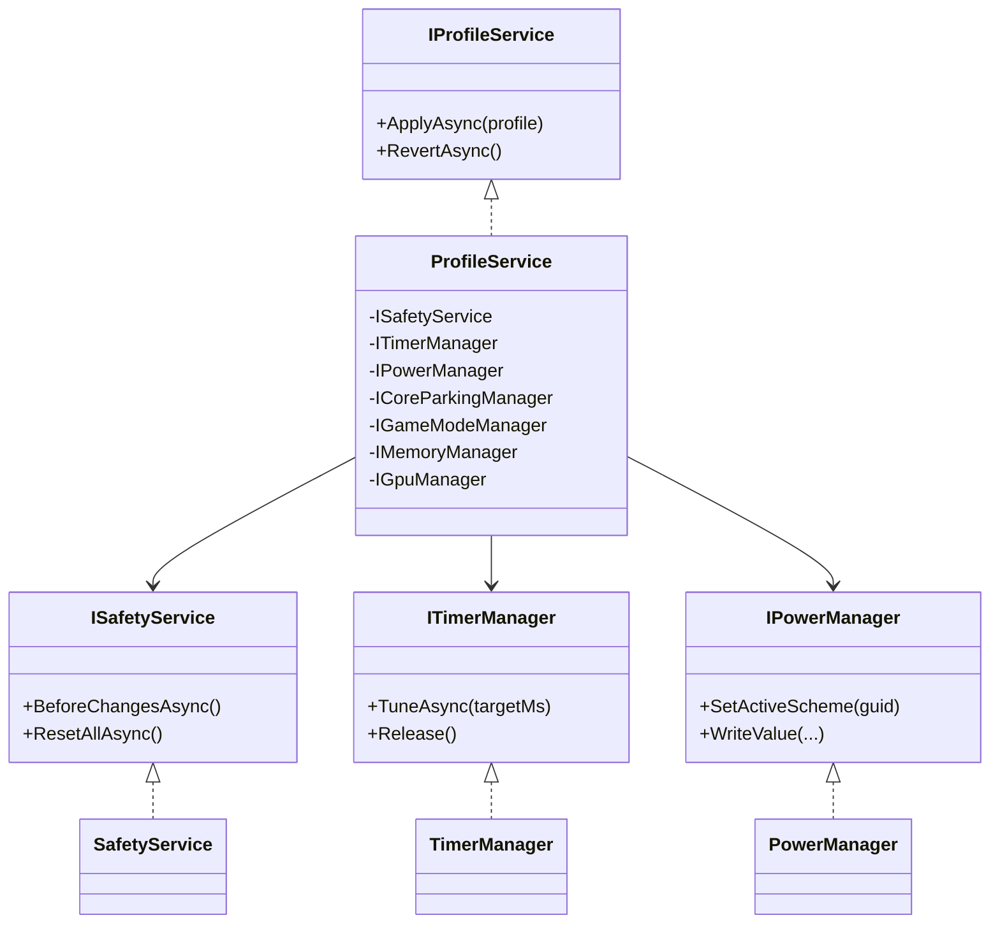

# AntiLag Next

Современный open-source аналог [AmbitiousPilots/AntiLag](https://github.com/AmbitiousPilots/AntiLag) на **C# / .NET 8 / WPF** с безопасным откатом, профилями, мониторингом latency и Win32 Power API.

> **Требуются права администратора** (UAC). Изменяются схема питания, реестр HKLM/HKCU, разрешение таймера.

---

## 1. Анализ оригинального AntiLag

### Что это

Закрытый **.NET Framework 4.7.2+** GUI (один EXE `68WAntiLagApp.exe`), лицензия **CC BY-NC-ND 4.0**, исходников в репозитории **нет** (только README + releases, alpha 2021).

### Заявленный функционал

| Возможность | Как заявлено |
|---|---|
| Timer Resolution ~0.5 ms | Держится фоновым процессом + autostart |
| Custom power plan | Дублирует активный план и «оптимизирует» |
| DPC latency ↓ | Следствие таймера + power plan |
| Game Mode / HAGS | Добавлено в v0.0.2a |
| NVIDIA stutter fix | v0.0.3a (RTX) |
| Undo | Disable + reboot |
| Портативность | «No install», файл на диске |

### Сильные стороны

1. **Простота** — Enable / Disable, понятный UX для геймеров.
2. **Связный набор** — таймер + питание + game mode, а не один «твик».
3. **Откат «в один клик»** (хотя и через reboot).
4. **Без сети** — offline tool.
5. **Ноутбуки** — заявлены.

### Главные недостатки

1. **Нет исходников** — нельзя аудитить, форкать, чинить.
2. **Перезагрузка обязательна** — часть твиков могла бы применяться live (power scheme, timer).
3. **Таймер требует вечного процесса** — без фонового hold resolution откатывается (особенно заметно до W11 22H2; после — per-process).
4. **Слабая безопасность** — нет System Restore Point, нет JSON-снимка ключей, слепой trust к closed binary.
5. **powercfg/shell** (типично для таких утилит) вместо `PowerWriteACValueIndex`.
6. **Нет профилей**, мониторинга, game detection, hybrid CPU (P/E-cores).
7. **Лицензия NC-ND** — нельзя делать derivative works.
8. **Alpha 2021** — не учитывает Win11 timer policy, HAGS edge cases, modern drivers.

### Вывод

AntiLag Next — **не форк** (форкать нечего), а **чистая реализация** идей с инженерными улучшениями: safety-first, Win32 API, MVVM, observability.

---

## 2. Архитектура AntiLag Next

### Компоненты (mermaid)



### Слои

| Проект | Роль |
|---|---|
| `AntiLagNext.Core` | Модели, enum, контракты — без Win32 |
| `AntiLagNext.Infrastructure` | P/Invoke, реализации, бэкап, WMI |
| `AntiLagNext.App` | WPF, Material Design, Serilog, DI |
| `native/AntiLagNext.Native` | C++ DLL (таймер + stub GPU) |
| `tests/AntiLagNext.Core.Tests` | xUnit unit-тесты моделей |

### Диаграмма классов (ключевые)



### Поток «Применить»

1. `ISafetyService.BeforeChangesAsync` → restore point (best-effort) + backup session  
2. Snapshot power/registry values → `IBackupService`  
3. Timer / Power / Parking / GameMode / HAGS / GPU / Memory  
4. `CommitChanges` → JSON в `%APPDATA%\AntiLagNext\backup\`  
5. UI status line обновляется  

### Поток «Сбросить всё»

1. `TimerManager.Release()`  
2. Restore latest `BackupRecord`  
3. Fallback: Balanced scheme  
4. `END_SYSTEM_CHANGE` restore point  

---

## 3. План разработки (спринты)

| Спринт | Срок | Содержание | Статус |
|---|---|---|---|
| **S0** | 1 нед | Core models, OperationResult, PowerGuids, abstractions | ✅ |
| **S1** | 1 нед | Native P/Invoke, Timer/Power/Parking managers | ✅ |
| **S2** | 1 нед | Safety: restore point + JSON backup + ResetAll | ✅ |
| **S3** | 1 нед | ProfileService, GameMode, Memory, GPU registry | ✅ |
| **S4** | 1 нед | WPF shell MVVM + Material Design + themes | ✅ |
| **S5** | 1 нед | Monitoring + Benchmark + Tips RU | ✅ |
| **S6** | 1 нед | Game Detection WMI, first-run UX | ✅ |
| **S7** | 1 нед | Native C++ DLL, installer (WiX/MSIX), code sign | 🔶 skeleton |
| **S8** | ongoing | PresentMon/DXGI frame-time, full NVAPI/ADLX | ⬜ roadmap |
| **hotfix** | — | PowerApplySetting bugfix, Game Detection wiring, build fixes | ✅ |
| **P1** | — | System CPU (GetSystemTimes), backup history UI | ✅ |
| **P2** | — | Tray + logo + publish/CI scripts | ✅ |

---

## 4. Сборка (Visual Studio 2022 / CLI)

### Требования

- Windows 10/11 x64  
- [.NET 8 SDK](https://dotnet.microsoft.com/download/dotnet/8.0)  
- (опционально) VS 2022 + C++ workload для native DLL  

### Сборка managed

```powershell
cd AntiLagNext
dotnet restore
dotnet build AntiLagNext.sln -c Release
dotnet test
```

Запуск:

```powershell
dotnet run --project src\AntiLagNext.App -c Release
```

Или: `src\AntiLagNext.App\bin\Release\net8.0-windows\win-x64\AntiLagNext.exe` (от администратора).

### Native DLL (опционально)

```powershell
cd native\AntiLagNext.Native
cmake -B build -A x64
cmake --build build --config Release
# скопировать AntiLagNext.Native.dll рядом с AntiLagNext.exe
```

Или:

```powershell
cl /LD /O2 /EHsc AntiLagNext.Native.cpp /Fe:AntiLagNext.Native.dll
```

### Установщик

- **MSIX**: обернуть publish output (`dotnet publish -r win-x64 --self-contained false`).  
- **WiX 4**: heat harvest + Product.wxs (шаблон в `packaging/` — добавить при релизе).  
- **Цифровая подпись**: `signtool sign /fd SHA256 /a AntiLagNext.exe` (сертификат Code Signing).

### Portable mode

Создайте пустой файл `AntiLagNext.portable` рядом с exe — данные пойдут в `.\data\` вместо `%APPDATA%`.

---

## 5. Функционал vs требования

| Требование | Реализация |
|---|---|
| Restore Point + JSON backup | `SafetyService`, `BackupService` |
| Reset all one-click | Dashboard «Сбросить всё» |
| WPF + MVVM + dark/light | Material Design, `SettingsViewModel` |
| Profiles Gaming/Office/Default | `OptimizationProfile.CreatePreset` |
| Status indicator | `StatusLine` |
| Latency monitoring | `MonitoringService` (QPC + waitable timer) |
| Timer auto-tune | `TimerManager.TuneAsync` |
| Core parking + hybrid | `CoreParkingManager` |
| GPU Low Latency | Registry + native stub |
| Empty Working Set + exclusions | `MemoryManager` + Profiles UI |
| Game Detection | WMI + polling fallback |
| First-run benchmark RU | `BenchmarkService` + banner |
| Tips | `TipsViewModel` |
| Serilog | file + debug |
| C++ DLL | `AntiLagNext.Native` |

---

## 6. Предупреждения

- Повышенное энергопотребление и температура — норма при High Performance + 0.5 ms timer.  
- HAGS может потребовать **перезагрузку**.  
- Windows 11 22H2+: timer resolution **per-process** — AntiLag Next должен работать в сессии пользователя.  
- NVAPI/ADLX SDK **не включены** (проприетарные) — GPU твики best-effort через реестр.  
- Используйте на свой риск; всегда доступен «Сбросить всё» и System Restore.

---

## 7. Структура репозитория

```
AntiLagNext/
  AntiLagNext.sln
  Directory.Build.props
  README.md
  native/AntiLagNext.Native/
  src/
    AntiLagNext.Core/
    AntiLagNext.Infrastructure/
    AntiLagNext.App/
  tests/
    AntiLagNext.Core.Tests/
```

## Лицензия

MIT (рекомендуется для open-source форков). Оригинальный AntiLag — CC BY-NC-ND; мы **не копируем** его код.
