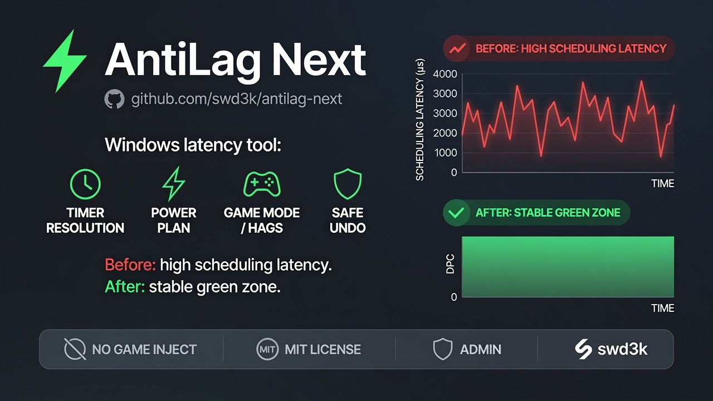

<p align="center">
  
</p>

<br>

<h1 align="center">AntiLag Next</h1>

<p align="center">
  AntiLag Next makes your system run as smooth as possible with lower input latency and a higher frame rate.
</p>

<p align="center">
  
  
  
  <a href="https://github.com/swd3k"></a>
  
</p>

<p align="center">
  Developer: <a href="https://github.com/swd3k">swd3k</a>
  ·
  <a href="https://github.com/swd3k/antilag-next/releases">Releases</a>
  ·
  <a href="LICENSE">MIT</a>
</p>

---

> [!NOTE]
> **Unofficial open-source** tool. Not affiliated with any game publisher or anti-cheat vendor.  
> Clean-room successor to the *ideas* behind [AmbitiousPilots/AntiLag](https://github.com/AmbitiousPilots/AntiLag) (**not a fork**).  
> **Use at your own risk.** Requires **Administrator** rights (UAC).

Desktop app for **Windows 10 / 11** that applies carefully scoped system tweaks (timer resolution, power plan, Game Mode / HAGS, GPU low-latency registry, and related options) to reduce **scheduling latency**. One-click **Enable**, full **Reset all**, optional tray + autostart.

---

> [!CAUTION]
> ### 🚫 FAKES
> I do **not** run any other pages, groups, Telegram, or YouTube channels for this project.  
> The **only** official source is **this GitHub repository**.  
> Anything distributed under my name outside this repo is a **FAKE**.

> [!WARNING]
> ### 🛡️ ANTIVIRUS & SmartScreen
> AntiLag Next requests **Administrator (UAC)** and may change power settings, registry keys, and timer resolution. Security software or Windows SmartScreen may flag the unsigned build.  
> This is **not a virus**: the source is fully open — review it or build it yourself.
>
> The executable is **not signed** with a paid code-signing certificate, so you may see *“Windows protected your PC”*. If you trust the source (and verified the download from GitHub Releases), choose **More info → Run anyway**. Add the app folder to antivirus exclusions if needed.

> [!IMPORTANT]
> ### 🔐 What you should know
> - Prefer builds from **[Releases](https://github.com/swd3k/antilag-next/releases)** only.  
> - The µs chart is a **scheduling-latency proxy** — **not** kernel DPC and **not** network ping.  
> - Experimental plugins are **MVP stubs** (disabled in the UI; they do **not** change the system).  
> - Always use **Reset all** if something feels wrong. Not sure? Build from source (below).

---

## ⚙️ What the app does

On **Enable AntiLag Next**, the app applies the selected profile (Gaming / Office / Max Performance) via Win32 APIs and registry paths: timer resolution hold, power scheme tuning, Game Mode / DVR / HAGS-related keys, GPU low-latency settings where applicable, and optional plugin modules (network hygiene, process priority, safe services, etc.).

Changes are backed by a **JSON backup** (and optional System Restore point when available). **Reset all** / CLI `--revert` restores the previous state as far as the backup allows.

**Before → After** (banner): red / high latency chart when idle → green / optimized after enable.

The monitor probes scheduling latency on a short interval and shows a live bar chart so you can compare *before vs after* — not absolute input lag in games.

---

## 🔒 Security notes

- Runs **elevated** by design — treat untrusted binaries of this class as high risk; prefer building from source.  
- Registry restore uses a **strict path allowlist**; service changes use a **safe-name allowlist**.  
- External `*.plugin.dll` loading is **opt-in**.  
- **Start with Windows** creates a Task Scheduler job only after an **explicit confirmation** dialog.  
- No telemetry; crash notes stay local when written.

See [SECURITY.md](SECURITY.md) for reporting vulnerabilities.

---

## 📥 Download

Get builds from **[Releases](https://github.com/swd3k/antilag-next/releases)**.

### Setup installer (recommended)

| Package | Arch | Notes |
|---------|------|-------|
| `AntiLagNext-Setup-win-x64.exe` | Intel / AMD 64-bit | **Installer** — *most users* |
| `AntiLagNext-Setup-win-x86.exe` | 32-bit | Installer |
| `AntiLagNext-Setup-win-arm64.exe` | ARM64 | Installer |

1. Run the **Setup** `.exe` (UAC / Administrator).  
2. Finish the wizard → launch **AntiLag Next**.  
3. Read onboarding → **Enable AntiLag Next**.  
4. If anything feels wrong → **Reset all**.

### Portable zip

| Package | Arch | Contents |
|---------|------|----------|
| `AntiLagNext-win-x64.zip` | Intel / AMD 64-bit | **UI** (`AntiLagNext.exe`) |
| `AntiLagNext-win-x86.zip` | 32-bit | UI |
| `AntiLagNext-win-arm64.zip` | ARM64 | UI |
| `AntiLagNext-cli-win-*.zip` | same RIDs | **CLI** (`AntiLagNext.Cli.exe`) |

1. Extract the zip.  
2. Run **`AntiLagNext.exe` as Administrator**.

**Runtime required (framework-dependent builds):** [.NET 8 Desktop Runtime](https://dotnet.microsoft.com/download/dotnet/8.0) and [WebView2](https://developer.microsoft.com/microsoft-edge/webview2/) (usually preinstalled on Windows 10/11).

---

## ✨ Features

- 🚀 One-click profiles: Gaming / Office / Max Performance  
- ⏱️ Timer resolution + power plan / core parking  
- 🎮 Game Mode / HAGS / GPU low-latency registry paths  
- ♻️ JSON backup + **Reset all** / CLI `--revert`  
- 🖥️ Tray icon; optional Windows logon autostart (confirm required)  
- 📊 Live latency chart (proxy, honest labels)  
- 🧩 Built-in plugins; experimental items marked **stub / soon**  
- 💻 CLI: `--apply`, `--revert`, `--status`  
- 📦 Portable UI ≈ **1.5 MB** FDD (≤ 5 MB size gate)

---

## 🛠️ Build from source

Requires **.NET 8 SDK** on Windows.

```powershell
cd AntiLagNext
dotnet restore
dotnet build AntiLagNext.sln -c Release
dotnet test AntiLagNext.sln -c Release
```

```powershell
# Shipping UI (Photino + WebView2)
dotnet run --project src\AntiLagNext.Ui -c Release

# CLI
dotnet run --project src\AntiLagNext.Cli -c Release -- --status
```

### Publish portable + Setup installers

```powershell
# win-x64 only (portable folder + zip)
.\scripts\publish.ps1

# all Windows CPUs: x64 + x86 + ARM64 (+ zip)
.\scripts\publish-all.ps1

# Inno Setup installers (requires Inno Setup 6) — framework-dependent (~2–3 MB)
.\scripts\build-installer.ps1 -Version 1.0.1

# publish + all Setup.exe in one go
.\scripts\build-installer.ps1 -Version 1.0.1 -PublishFirst

# self-contained Setup (includes .NET runtime, larger ~60–80 MB) → *-SC.exe
.\scripts\build-setup-selfcontained.ps1 -Version 1.0.1 -Rid win-x64

# full hard suite: restore, build, tests, publish, size gate
.\scripts\hard-test.ps1
```

Self-contained portable folders only:

```powershell
.\scripts\publish-all.ps1 -SelfContained
```

Settings auto-migrate on load (schema v2): legacy Russian built-in profile names become stable English labels; the UI always localizes via language packs.

CI builds on every push to `main` and on pull requests. Releases are created on tags `v*` (e.g. `v1.0.0`) with multi-arch **Setup.exe** installers and portable zips attached.

---

## 👨‍💻 For development

```powershell
cd AntiLagNext
dotnet restore
dotnet build AntiLagNext.sln -c Debug
dotnet test tests\AntiLagNext.Core.Tests\AntiLagNext.Core.Tests.csproj -c Release
dotnet test tests\AntiLagNext.SmokeTests\AntiLagNext.SmokeTests.csproj -c Release
```

Shipping host: **`AntiLagNext.Ui`** (Photino).  
Legacy WPF **`AntiLagNext.App`** is reference-only and **not built by default**.

---

## 📂 Repository layout

```
├── AntiLagNext/                 # .NET solution
│   ├── src/AntiLagNext.Ui       # ★ Photino UI (shipping)
│   ├── src/AntiLagNext.Cli
│   ├── src/AntiLagNext.Core
│   ├── src/AntiLagNext.Infrastructure
│   ├── src/AntiLagNext.App      # legacy WPF (not default build)
│   └── tests/
├── docs/                        # architecture, plugins, banner
├── scripts/                     # publish / hard-test
├── installer/                   # Inno Setup script → Setup.exe
├── LICENSE
└── README.md
```

---

## 🔗 Useful links

- 💻 Source — https://github.com/swd3k/antilag-next  
- 📦 Releases — https://github.com/swd3k/antilag-next/releases  
- 📐 Architecture — [docs/ARCHITECTURE.md](docs/ARCHITECTURE.md)  
- 🔌 Plugins — [docs/PLUGINS.md](docs/PLUGINS.md)  
- 🔐 Security policy — [SECURITY.md](SECURITY.md)  
- 🤝 Contributing — [CONTRIBUTING.md](CONTRIBUTING.md)

---

## ⚖️ Disclaimer

Intended for users who understand system power and registry tweaks. Changing elevated system settings is **at your own risk**. A backup is created when possible; full recovery is not guaranteed on every machine or GPO-locked PC.

The author (**swd3k**) is not liable for instability, data loss, or hardware stress.

---

## 🧩 Tech stack

`C#` · `.NET 8` · `Photino.NET` · `WebView2` · `Win32` (`ntdll` / `powrprof` / `kernel32`) · `Windows Forms` (tray)

---

## 📄 License

[MIT](./LICENSE) © 2026 [swd3k](https://github.com/swd3k)
