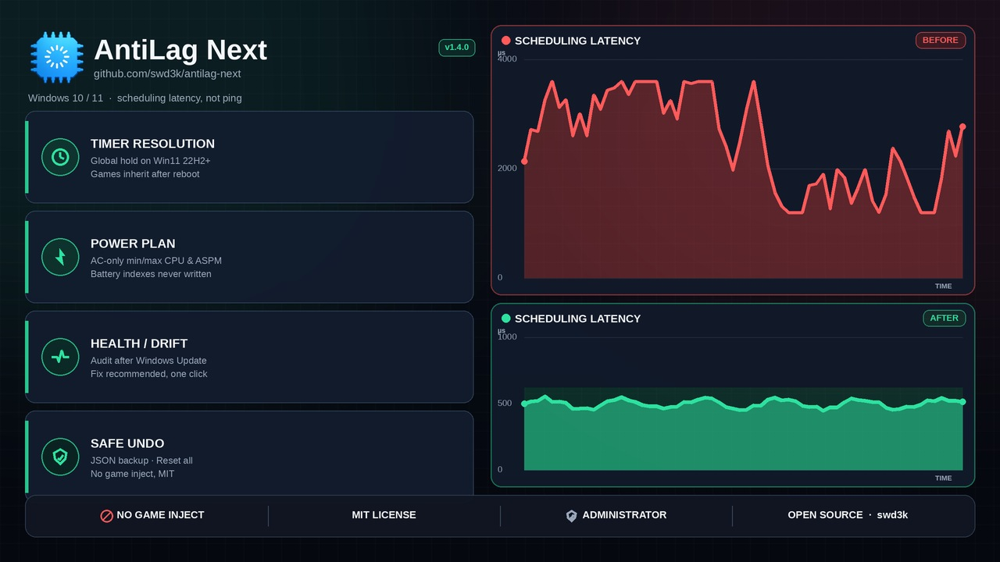

<p align="center">
  
</p>

<h1 align="center">AntiLag Next</h1>

<p align="center">
  Open-source <strong>Windows 10 / 11</strong> tool that holds <strong>timer resolution</strong>,
  tunes the <strong>AC power plan</strong>, and <strong>audits drift</strong> — then undoes everything.<br>
  No game inject. No telemetry. MIT.
</p>

<p align="center">
  <a href="https://github.com/swd3k/antilag-next/releases/latest"></a>
  
  
  
  <a href="https://github.com/swd3k"></a>
</p>

<p align="center">
  <a href="https://github.com/swd3k/antilag-next/releases/latest/download/AntiLagNext-Setup-1.4.0-win-x64.exe"></a>
  &nbsp;
  <a href="https://github.com/swd3k/antilag-next/releases/latest"></a>
</p>

<p align="center">
  <sub>
    Latest <strong>1.4.0</strong>
    · <a href="https://github.com/swd3k/antilag-next/releases/latest/download/AntiLagNext-Setup-1.4.0-win-x64.exe"><code>AntiLagNext-Setup-1.4.0-win-x64.exe</code></a>
    · other arch, portable ZIP, CLI, and <code>SHA256SUMS.txt</code> on
    <a href="https://github.com/swd3k/antilag-next/releases">Releases</a>
  </sub>
</p>

---

> [!NOTE]
> Unofficial open-source tool. Not affiliated with any game publisher or anti-cheat vendor.
> Clean-room successor to the *ideas* behind [AmbitiousPilots/AntiLag](https://github.com/AmbitiousPilots/AntiLag) (**not a fork**).
> Requires **Administrator** (UAC). Use at your own risk.

The live chart is a **scheduling-latency proxy in µs** — not kernel DPC/ISR and not network ping.

---

## What 1.4.0 changed

| Topic | Reality |
| ----- | ------- |
| **Windows 11 22H2+ timer** | Games inherit the hold only after `GlobalTimerResolutionRequests=1` **and a reboot**. The UI shows *global / this-process / reboot needed*. |
| **Laptops** | Power writes are **AC-only**. Core parking never pins 100% cores on battery. |
| **Defaults** | **HAGS** and working-set trim are **off**. They often add hitching or extra input lag. |
| **Safety** | Process-priority plugin no longer boosts AntiLag itself. Releases ship **SHA256SUMS.txt**. |

Full notes: [CHANGELOG.md](CHANGELOG.md).

---

## What it does

On **Enable**, the selected profile (**Gaming** / **Office** / **Max Performance**) applies a scoped set of OS tweaks:

1. **Timer resolution** — `timeBeginPeriod` + `NtSetTimerResolution`; on Win11, the global registry key so other processes can inherit it.
2. **Power plan** — min/max CPU, ASPM, core parking **on AC only**. Scheme switch is skipped on battery.
3. **Game Mode / DVR** and GPU low-latency registry where it applies. HAGS only if you opt in.
4. A **curated latency pack** (network / input / kernel) behind backup + path allowlist.

After Enable you get **What changed**, a **Before / After** median µs window, and optional reboot / autostart (confirm required).

**Health** audits key settings, detects **desired-state drift** after Windows Update, and can **Fix recommended** (Safe + reapply owned state). Everything is stored as JSON backup (System Restore when available). **Reset all** / `AntiLagNext.Cli --revert` rolls it back.

---

## Features

| Area | What ships |
| ---- | ---------- |
| Profiles | One-click Gaming / Office / Max Performance |
| Timer | `timeBeginPeriod` + `NtSetTimerResolution`; Win11 global key + reboot |
| Power | AC-only min/max CPU & ASPM; DC core parking capped |
| Health | Audit, drift, Fix recommended / Fix safe / Fix all |
| Transparency | What changed; Before/After median µs; live chart (200–15000 µs, Peak = 60 s) |
| Safety | JSON backup, Reset all, registry allowlist, SHA256SUMS |
| Desktop | Tray, optional logon autostart, single UI instance, in-app update |
| CLI | `--apply` / `--revert` / `--status` |
| i18n | English + Russian packs (parity gated in CI) |

---

## Download

Prefer **[GitHub Releases](https://github.com/swd3k/antilag-next/releases/latest)** only.

### Setup (recommended)

| Package | Arch |
| ------- | ---- |
| [`AntiLagNext-Setup-1.4.0-win-x64.exe`](https://github.com/swd3k/antilag-next/releases/latest/download/AntiLagNext-Setup-1.4.0-win-x64.exe) | Intel / AMD 64-bit |
| [`AntiLagNext-Setup-1.4.0-win-x86.exe`](https://github.com/swd3k/antilag-next/releases/latest/download/AntiLagNext-Setup-1.4.0-win-x86.exe) | 32-bit |
| [`AntiLagNext-Setup-1.4.0-win-arm64.exe`](https://github.com/swd3k/antilag-next/releases/latest/download/AntiLagNext-Setup-1.4.0-win-arm64.exe) | ARM64 |

Run Setup (UAC) → first-run wizard → pick a profile → **Enable**. If anything feels wrong → **Reset all**.

Silent in-app updates work for **Program Files** installs. Portable builds open Releases for a manual Setup.

### Portable ZIP

| Package | Contents |
| ------- | -------- |
| `AntiLagNext-win-x64.zip` (x86 / arm64 too) | UI (`AntiLagNext.exe`) |
| `AntiLagNext-cli-win-*.zip` | CLI (`AntiLagNext.Cli.exe`) |

Extract and run **`AntiLagNext.exe` as Administrator**.

**Runtime** (framework-dependent builds): [.NET 8 Desktop Runtime](https://dotnet.microsoft.com/download/dotnet/8.0) and [WebView2](https://developer.microsoft.com/microsoft-edge/webview2/) (usually already on Windows 10/11).

Verify downloads against `SHA256SUMS.txt` on the same release.

---

## Safety

> [!CAUTION]
> **Fakes.** I do not run Telegram, YouTube, or other pages for this project. The **only** official source is **this GitHub repository**.

> [!WARNING]
> The executable is **not code-signed**. SmartScreen / antivirus may flag an elevated unsigned binary that touches power and the registry. This is **not a virus** — the source is public; prefer building it yourself. If you trust the GitHub Release: *More info → Run anyway*.

- Treat untrusted binaries of this class as high risk.
- Registry restore uses a **path allowlist**; services use a **safe-name allowlist**.
- External `*.plugin.dll` loading is **opt-in** (default off).
- Start with Windows / reboot only after **explicit confirmation**.
- In-app update pulls official Setup URLs only (repo + CDN allowlist, size + PE checks).
- Diagnostics export is **local** (redacted). No telemetry.

See [SECURITY.md](SECURITY.md) to report vulnerabilities.

---

## Build from source

Requires **.NET 8 SDK** on Windows.

```powershell
cd AntiLagNext
dotnet restore
dotnet build AntiLagNext.sln -c Release
dotnet test AntiLagNext.sln -c Release
```

```powershell
# Shipping UI (Photino + WebView2) — run elevated for real tweaks
dotnet run --project src\AntiLagNext.Ui -c Release

# CLI
dotnet run --project src\AntiLagNext.Cli -c Release -- --status

# i18n key parity
.\scripts\check-i18n.ps1
```

### Publish + installers

```powershell
.\scripts\publish.ps1                          # win-x64 portable
.\scripts\publish-all.ps1                      # x64 + x86 + ARM64
.\scripts\build-installer.ps1 -Version 1.4.0 -PublishFirst   # Inno Setup 6
.\scripts\build-setup-selfcontained.ps1 -Version 1.4.0 -Rid win-x64
.\scripts\hard-test.ps1                        # restore, build, tests, size gate
```

Settings migrate on load (schema **v3**): built-in Gaming/Max turn HAGS and RAM-trim off once; custom profiles are left alone. Shipping host is **Photino** (`AntiLagNext.Ui`); WPF was removed in 1.2.0.

CI runs Core + Infrastructure + Smoke + i18n on `main` and PRs. Tags `v*` publish multi-arch Setup, ZIP, and `SHA256SUMS.txt`.

---

## Repository layout

```
AntiLagNext/                 .NET solution
  src/AntiLagNext.Ui         Photino UI (shipping)
  src/AntiLagNext.Cli
  src/AntiLagNext.Core
  src/AntiLagNext.Infrastructure
  tests/
docs/                        architecture, plugins, banner, QA
scripts/                     publish / installer / hard-test / i18n / banner
installer/                   Inno Setup → Setup.exe
```

- [CHANGELOG](CHANGELOG.md) · [Architecture](docs/ARCHITECTURE.md) · [Plugins](docs/PLUGINS.md)
- [Security](SECURITY.md) · [Contributing](CONTRIBUTING.md) · [License](LICENSE)

---

## Disclaimer

Intended for people who understand power and registry tweaks. Elevated system changes are **at your own risk**. A backup is created when possible; full recovery is not guaranteed on every machine or GPO-locked PC. The author (**swd3k**) is not liable for instability, data loss, or hardware stress.

Latency-pack ideas inspired by [emylfy/Winrift](https://github.com/emylfy/Winrift) (MIT) — reimplemented as a curated Safe/Moderate subset with backup, allowlist, and drift tracking; not a fork.

**Stack:** C# · .NET 8 · Photino.NET · WebView2 · Win32 (`ntdll` / `powrprof` / `winmm` / `kernel32`) · Windows Forms tray

[MIT](LICENSE) © 2026 [swd3k](https://github.com/swd3k)
